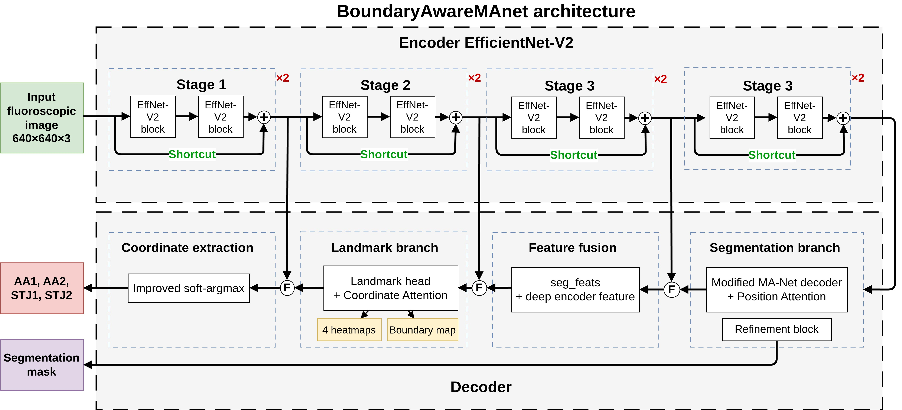
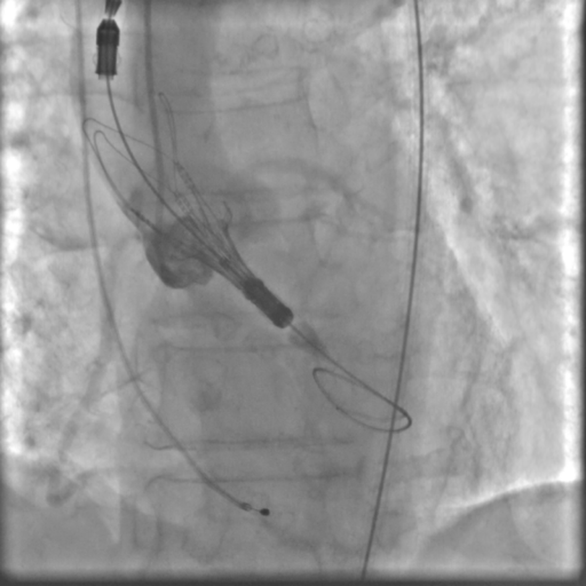
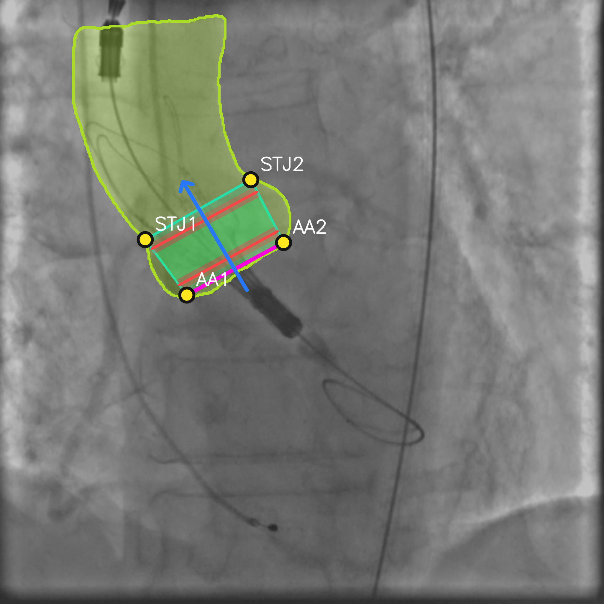
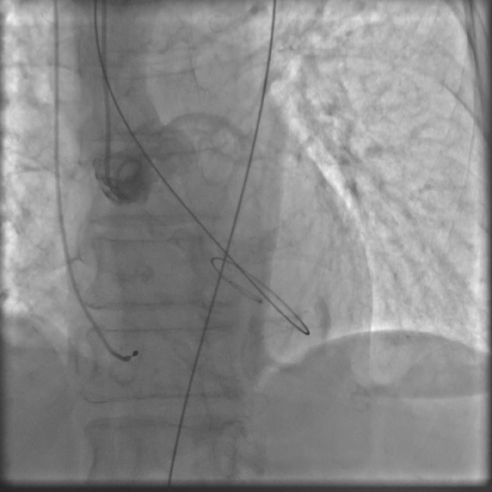
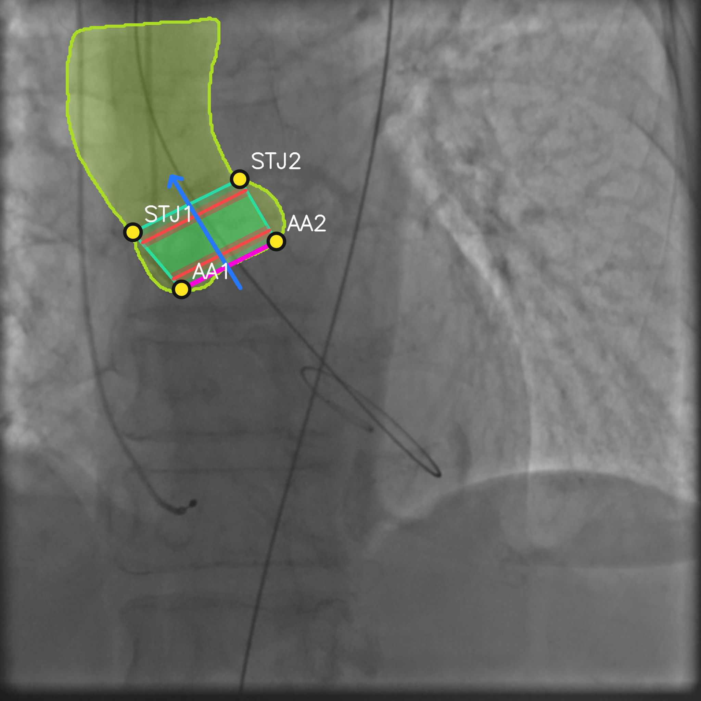
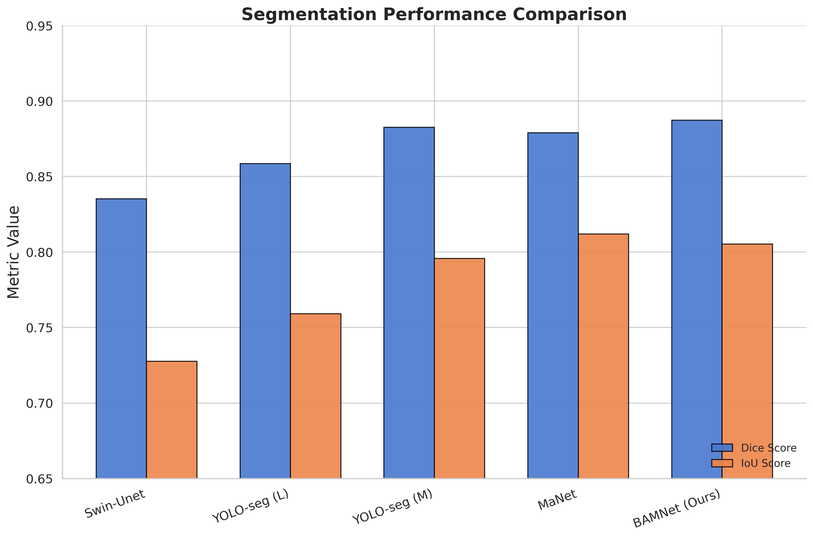
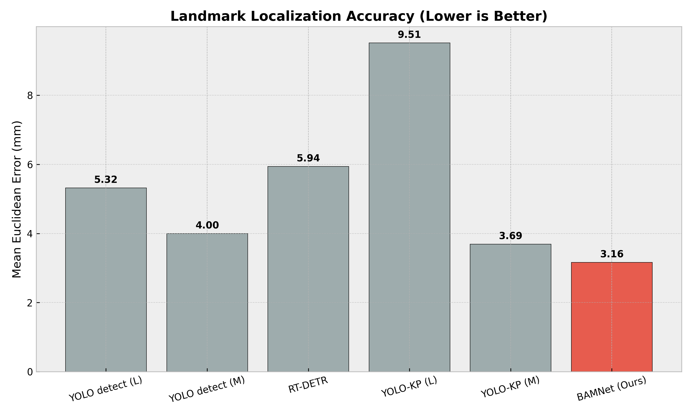

# BoundaryAwareMAnet: Multi-Task FluoroscopicSegmentation of the Aortic Root and LandmarkLocalization for TAVI Guidance

This repository accompanies the manuscript `BoundaryAwareMAnet: Multi-Task FluoroscopicSegmentation of the Aortic Root and LandmarkLocalization for TAVI Guidance`. `BoundaryAwareMAnet (BAMNet)` is a multitask deep learning project for fluoroscopic guidance during transcatheter aortic valve implantation (TAVI). The model predicts the aortic root mask and four anatomical landmarks in one forward pass:

- `AA1`
- `AA2`
- `STJ1`
- `STJ2`

BAMNet is designed for low-contrast intraoperative fluoroscopy, where the anatomy is partially occluded by catheters, guidewires, and valve delivery systems.

<p align="center">
  
</p>

## Highlights

- Joint segmentation and landmark localization for TAVI fluoroscopy.
- `EfficientNet-V2` encoder with a `MA-Net`-inspired decoder.
- Landmark head with coordinate-aware feature modulation.
- Boundary-aware supervision and segmentation-to-landmark feature fusion.
- Dataset: `2925` fluoroscopic frames from `83` patients.
- Publication-level patient-wise `5`-fold cross-validation:
  - Dice: `0.9163 ± 0.0108`
  - IoU: `0.8500 ± 0.0177`
  - Surface Dice@4 mm: `0.8446 ± 0.0312`
  - median landmark error: `7.64 ± 0.33 px`
  - mean landmark error: `10.02 ± 0.17 px`
- Real-time inference reported in the manuscript: `62.5 FPS`

## Qualitative Examples

Representative predictions from `BoundaryAwareMAnet: Multi-Task FluoroscopicSegmentation of the Aortic Root and LandmarkLocalization for TAVI Guidance` on intraoperative fluoroscopic frames:

<table>
  <tr>
    <th>Input fluoroscopy</th>
    <th>BAMNet prediction</th>
  </tr>
  <tr>
    <td></td>
    <td></td>
  </tr>
  <tr>
    <td></td>
    <td></td>
  </tr>
</table>

The green overlay shows the predicted aortic root mask, and the labeled points correspond to `AA1`, `AA2`, `STJ1`, and `STJ2`.

## Results from the Publication

The current manuscript for `BoundaryAwareMAnet: Multi-Task FluoroscopicSegmentation of the Aortic Root and LandmarkLocalization for TAVI Guidance` and its summary tables are stored under [publication/](./publication/). The core `BoundaryAwareMAnet (BAMNet)` results reported in the paper are:

| Protocol                |                 Dice |                  IoU |    Surface Dice@4 mm |         Median err. |            Mean err. |
| ----------------------- | -------------------: | -------------------: | -------------------: | ------------------: | -------------------: |
| Patient-level 5-fold CV | `0.9163 ± 0.0108` | `0.8500 ± 0.0177` | `0.8446 ± 0.0312` | `7.64 ± 0.33 px` | `10.02 ± 0.17 px` |

Best fold in the current cross-validation summary:

- `fold_04` achieved Dice `0.9319` and IoU `0.8761`
- `fold_05` achieved the lowest median landmark error: `7.32 px`
- `fold_03` achieved the lowest mean landmark error: `9.91 px`

Landmark-wise localization summary:

| Landmark |    Mean err. (px) | Median err. (px) |
| -------- | ----------------: | ---------------: |
| `AA1`  |  `7.96 ± 0.73` | `5.92 ± 0.40` |
| `AA2`  | `11.89 ± 0.62` | `9.95 ± 1.37` |
| `STJ1` | `10.20 ± 0.87` | `7.66 ± 0.14` |
| `STJ2` | `10.02 ± 1.46` | `7.73 ± 0.93` |

### Comparison with Baselines

Segmentation comparison from the manuscript:

<p align="center">
  
</p>

Localization comparison from the manuscript:

<p align="center">
  
</p>

Practical takeaway:

- `Swin-Unet` reaches slightly higher pure segmentation quality, but it is much slower (`1.91 FPS` in the manuscript comparison).
- BAMNet stays close to the strongest segmentation baselines while also predicting landmarks.
- BAMNet gives the best mean landmark localization error among the compared methods and remains suitable for real-time overlay generation.

## Project Overview

The main training pipeline is implemented in PyTorch Lightning. The repository is centered on supervised training, validation, checkpointing, and qualitative visualization of predictions.

Core components:

- [train.py](./train.py) — main training entry point.
- [data.py](./data.py) — dataset, augmentation, datamodule, and debug visualization.
- [model_backbone_coords.py](./model_backbone_coords.py) — BAMNet architecture and Lightning module.
- [config.yaml](./config.yaml) — default training configuration.
- [prepare_data/](./prepare_data/) — utilities for dataset restoration, conversion, and Zenodo publication.
- [dataset_metadata/](./dataset_metadata/) — tracked metadata and fold manifests.
- [publication/](./publication/) — manuscript sources, result summaries, and figures.

Additional directories currently present in the repo:

- `Swin-Unet/` — segmentation baseline code.
- `ultralistics_models/` — YOLO-based baseline experiments.
- `ablation/` — ablation configs and related experiment assets.

## Environment Setup

The repository does not currently ship a pinned root `requirements.txt`, so installation is based on the imports used by the training code.

Recommended environment:

- Python `3.10+`
- PyTorch with CUDA support for training on GPU

Example setup:

```bash
python -m venv .venv
source .venv/bin/activate
pip install --upgrade pip

# Install the PyTorch build appropriate for your system first.
# Example for CUDA 12.1:
pip install torch torchvision --index-url https://download.pytorch.org/whl/cu121

pip install pytorch-lightning albumentations opencv-python matplotlib pyyaml tensorboard numpy
```

If you train on CPU only, install the CPU build of PyTorch instead of the CUDA wheel.

## Data Root and Repository Hygiene

This repository is intended to stay source-only by default.

- Commit code, configs, docs, and small reproducibility metadata.
- Keep large datasets, prepared exports, YOLO outputs, and training artifacts outside the git-tracked tree.
- Set `BAMNET_DATA_ROOT` to the external data root. If it is unset, the code falls back to `/mnt/ssd4tb/data/BAMNet-data`.

Example:

```bash
export BAMNET_DATA_ROOT=/mnt/ssd4tb/data/BAMNet-data
```

Expected external layout:

```text
$BAMNET_DATA_ROOT/
├── export_project/
├── segmentation_point(v2)/
├── runs/
└── ablation_runs/
```

## Dataset and Zenodo

The dataset published at `https://zenodo.org/uploads/19219901` is a raw `Supervisely` export. BAMNet does not train directly from this structure, so the archive must be unpacked and converted first.

Recommended layout after download:

```text
$BAMNET_DATA_ROOT/export_project/segmentation_point/
├── meta.json
├── README.md
├── 001/
├── 002/
└── ...
```

Example unpack commands:

```bash
export BAMNET_DATA_ROOT=/mnt/ssd4tb/data/BAMNet-data
mkdir -p "$BAMNET_DATA_ROOT/export_project"

# If Zenodo provides a zip archive:
unzip /path/to/segmentation_point.zip -d "$BAMNET_DATA_ROOT/export_project"

# If Zenodo provides a tar.gz archive:
tar -xzf /path/to/segmentation_point.tar.gz -C "$BAMNET_DATA_ROOT/export_project"
```

Then convert the raw `Supervisely` export into the BAMNet training format:

```bash
python prepare_data/convert_data.py \
  --input "$BAMNET_DATA_ROOT/export_project/segmentation_point" \
  --output "$BAMNET_DATA_ROOT/export_project/segpoint_holdout" \
  --train-patients 70 \
  --val-patients 13
```

If the archive does not contain `img/` inside patient folders, see [prepare_data/README.md](./prepare_data/README.md) for the image restoration workflow and metadata enrichment with `pixel_spacing_row_mm`.

## Expected Training Dataset Layout

The training code expects a directory pointed to by `data_path` in [config.yaml](./config.yaml) with this structure:

```text
<data_path>/
├── train/
│   ├── images/
│   ├── masks/
│   └── points/
└── val/
    ├── images/
    ├── masks/
    └── points/
```

Expected file conventions:

- images: `*.png`, `*.jpg`, `*.jpeg`
- masks: `*.png`
- points: `*.json`
- filenames must share the same basename across `images/`, `masks/`, and `points/`

Point annotations support either absolute or normalized coordinates. A typical JSON file looks like:

```json
{
  "image_size": { "width": 1000, "height": 1000 },
  "points": {
    "AA1":  { "x": 120, "y": 540, "visible": 1 },
    "AA2":  { "x": 410, "y": 548, "visible": 1 },
    "STJ1": { "x": 170, "y": 310, "visible": 1 },
    "STJ2": { "x": 365, "y": 300, "visible": 1 }
  }
}
```

The loader also accepts normalized coordinates via `x_norm` and `y_norm`.

## Configuration

The default configuration is stored in [config.yaml](./config.yaml). The most important fields are:

- `data_path` — path to the current fold or holdout split.
- `encoder_name` — for example `efficientnet_v2_m`.
- `img_size` — input image size.
- `batch_size` — batch size.
- `num_points` and `point_names` — landmark definition.
- `logging.save_dir` and `logging.experiment_name` — output location.
- `trainer.epochs`, `trainer.devices`, `trainer.precision` — Lightning trainer settings.

Default landmark order:

```yaml
point_names: ["AA1", "AA2", "STJ1", "STJ2"]
```

The current default [config.yaml](./config.yaml) points to:

```text
${BAMNET_DATA_ROOT}/export_project/segpoint_folds/fold_01
```

So it assumes a prebuilt patient-level fold split. If you only converted the Zenodo export into a simple holdout dataset, change `data_path` to:

```text
${BAMNET_DATA_ROOT}/export_project/segpoint_holdout
```

## How to Run Training

1. Export `BAMNET_DATA_ROOT` if you use a custom external data root.
2. Activate the environment.
3. Check that `data_path` in [config.yaml](./config.yaml) points to the dataset you want to use.
4. Start training:

```bash
python train.py --config config.yaml
```

Example with parameter overrides:

```bash
python train.py \
  --config config.yaml \
  --lr 1e-4 \
  --w_pts 1.0 \
  --w_bnd 0.1 \
  --exp_name bamnet_ablation
```

The trainer automatically uses GPU when `torch.cuda.is_available()` is true; otherwise it falls back to CPU.

## Training Outputs

By default, training artifacts are written to:

```text
$BAMNET_DATA_ROOT/runs/<experiment_name>/<architecture>/<version>/
```

Typical contents:

- TensorBoard logs
- CSV logs
- checkpoints
- `best.pt` symlink or copied best checkpoint
- `val_vis/` — qualitative validation predictions
- `debug_inspect/` — saved sample previews from train and val splits

To inspect logs:

```bash
tensorboard --logdir "$BAMNET_DATA_ROOT/runs"
```

## Publications and Related Material

- Previous published segmentation study:
  - Laptev NV, Gerget OM, Belova JK, Vasilchenko EE, Chernyavskiy MA, Danilov VV.
  - *Optimized aortic root segmentation during transcatheter aortic valve implantation*.
  - Frontiers in Cardiovascular Medicine, 2025.
  - DOI: `10.3389/fcvm.2025.1602780`

## Notes

- The repository contains active research code and publication materials.
- Paths in [config.yaml](./config.yaml) and helper scripts resolve through `BAMNET_DATA_ROOT`.
- `Swin-Unet/` and `ultralistics_models/` are baseline directories and are not required for BAMNet training itself.
